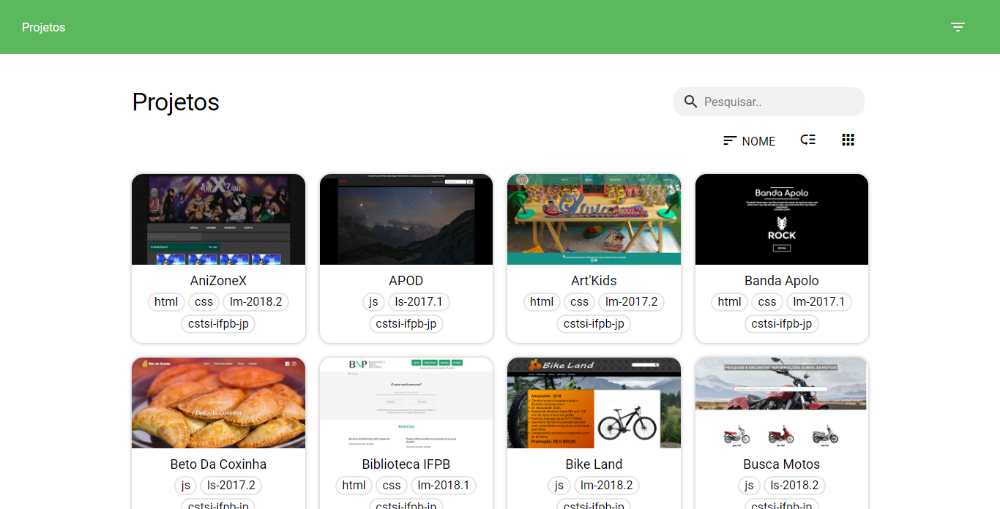
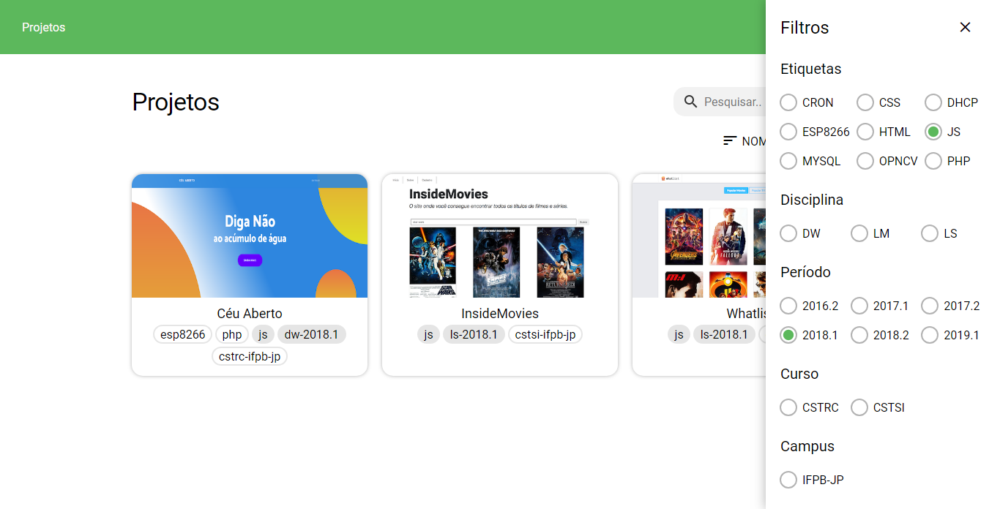
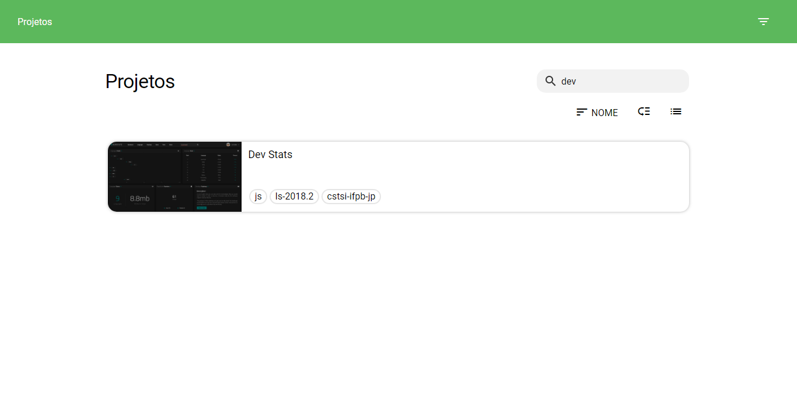

    
      

Inicialmente este projeto foi desenvolvido com o objetivo de realizar o [desafio](https://ifpb.github.io/challenges/front-end-web/ifpb-projects), onde pede-se para fazer um filtrador de projetos.

## Detalhes

Neste projeto é utilizado apenas HTML, CSS e Javascript (ES7). Para o fron-end foi utilizado o [Paradox](https://github.com/MePaper/Paper) meu proprio Framework CSS.

## Screenshots

Acesse esse [link](https://www.dropbox.com/s/dnvk4sbvavh9tbt/preview-ifpb-projects%20%28fast%29.mp4?dl=0) para ver o video de demontração.
